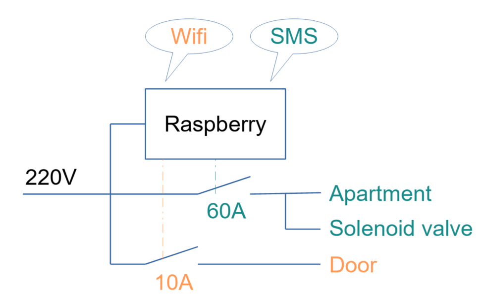

<h1 align="center">
  <br>
  <a href="https://www.associés.fr"></a>
</h1>

<h4 align="center">Box Airbnb - domotics with SMS and Wi-Fi</h4>

## Overview

Box Airbnb provides the floowing features:

### Domotics through SMS messages

Using the gammu software, this feature allows you to start/stop relays. For example, you can shut down the power of an apartment when no one is living there. Shutting down the power can also trigger the shutdown of water by placing an solenoid valve in the apartment 

### Door opening by connecting to a wifi network with the correct password

By setting up a Wi-Fi network as an access point, the DHCP server can monitor when a Wi-Fi client has connected. With this project, it opens a relay that can open a door.



## Green Technology

Box Airbnb embraces green technology by promoting energy efficiency. Through the domotics features, it allows for intelligent control of power usage in apartments, reducing unnecessary energy consumption when no one is present. This not only helps to save energy but also contributes to a more sustainable environment.

Moreover, the domotics system can also prevent water wastage by addressing potential issues such as leaks. When there are no tenants present, the system can automatically shut off the water supply using solenoid valves, preventing water leaks or any unnecessary water usage. This proactive approach ensures efficient water management, reducing water waste and promoting a greener living environment.

## Hardware Requirements

### Computer System

Box Airbnb is designed for small Raspberry Pi cards with Wi-Fi and GSM (2G, 3G) capabilities. Alternatively, you can use a USB dongle if your CPU cards does not provide Wi-Fi and/or GSM.

### Domotics

You will need some relays that are compatible with GPIO 3V & 5V. Additionally, dépending on your needs, you may require an electronic locker, an electrovalve.

## Software Requirements

You will need a Linux system with the following software installed: isc-dhcp-server and gammu.

To install these packages, run the following command:

```shell
apt-get install isc-dhcp-server gammu dnsmasq
```

You will also need the "gpio" utility, such as [WiringPi](https://github.com/orangepi-xunlong/wiringOP "Gpio utility")

## Installation

Copy the files in a directory of your choice.

### Modify the gammu configuration file

In the file `/etc/gammu-smsdrc`, under the `[smsd]` section, add the following line:

`RunOnReceive=/script/parseSMS.sh`

### Set wifi network as an access point

```shell
nmcli d wifi hotspot ifname wlp1s0 ssid Appartement_XXX password password
```
Where wlp1s0 is wlan device, can be wlan0 of call ifconfig if no more ideas. 

### Modify the dhcpd configuration

Edit the file `/etc/dhcp/dhcpd.conf` and insert the following lines:

```
subnet 192.168.10.0 netmask 255.255.255.0 {
  range 192.168.10.10 192.168.10.100;
} 

on commit {
  execute("/script/onDhcpRun.sh", "commit", "","");
}
```

### Add a crontab

Add the following line to the crontab:

```shell
@reboot /script/startup.sh
```

## Configuration

You need to adapt the configuration file located at `script/config`. Modify the GPIO numbers and allowed phone numbers according to your requirements.